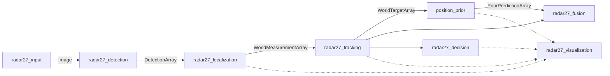

# Radar27 分包架构

主链按消息连接，不跨包引用业务实现。旧 `tensorrt_detect` 包已彻底移除，总入口统一为 `radar27_bringup`，当前共 12 个包。



融合输出 `/fused_targets` 继续保持独立分支。当前 `/radar_map`、`/map_tactics` 仍以 `/world_targets` 为输入，没有改变成采用先验坐标的业务输出。串口/裁判系统接入不在本次改动内。

## 包与边界

| 包 | 负责内容 | 不依赖的实现 |
|---|---|---|
| `radar27_interfaces` | 消息字段、坐标单位、来源和版本契约 | 所有业务包 |
| `rm_field` | 场地坐标、兵种/阵营编码、槽位映射 | ROS、OpenCV、GPU、UI |
| `radar27_input` | 视频输入、暂停、工业相机及 SDK 封装 | 检测、定位、跟踪 |
| `radar27_detection` | TensorRT/CUDA、车/装甲板/兵种流水线、检测调试图 | Open3D、Tracker、地图 |
| `radar27_localization` | 内外参、射线投影、协方差、车框/装甲板投影选择 | TensorRT、Tracker、RViz |
| `radar27_tracking` | Kalman、Hungarian、身份稳定、槽位、特殊目标适配 | GPU、mesh、Qt、检测配置 |
| `position_prior` | 先验、导航网格、盲区、运动门控 | Tracker 内部状态、绘图 |
| `radar27_fusion` | 消息来源选择、时效/身份/标定版本校验 | 跟踪和先验算法实现 |
| `radar27_decision` | 战术摘要、旧像素地图输出、权威阵营状态 | 地图图片、OpenCV、UI |
| `radar27_visualization` | Qt、地图图片、RViz Marker/TF | 推理/定位/跟踪实现 |
| `radar27_tools` | 人工标定与 ROI 编辑、原子写入及重载通知 | TensorRT、Open3D、主链对象 |
| `radar27_bringup` | 启动组合、部署配置、场地资源路径 | 无算法实现 |

纯跟踪核心库不链接 ROS、TensorRT、Open3D、Qt。ROS 消息转换编译进跟踪节点。检测/定位各自保留算法核心与节点适配层。可视化只消费消息，GPU 射线查询的互斥量留在定位共享库，已移除对推理头文件的引用。当前没有新增跨库 GPU 调度器，也没有宣称 TensorRT/Open3D 并发安全；正式主链仍使用单线程组件容器。

相机 SDK 在 `radar27_input/vendor/rb26SDK`；`BUILD_CAMERA` 默认关闭，视频回放不要求安装相机 SDK。已有 SDK 代码和许可文件随目录保留。

## 数据契约

| 话题 | 类型 | 发布者 | 语义 |
|---|---|---|---|
| `/image_raw` | `sensor_msgs/Image` | input | 原始图像与采集时间 |
| `/armor_detections` | `DetectionArray` | detection | 原图像素坐标，保留输入 header |
| `/world_measurements` | `WorldMeasurementArray` | localization | 单帧世界测量、2×2 协方差、有效性、标定版本 |
| `/world_targets` | `WorldTargetArray` | tracking | 跟踪快照、身份与生命周期、标定版本 |
| `/prior_predictions` | `PriorPredictionArray` | position_prior | 独立先验，继承标定版本 |
| `/fused_targets` | `FusedTargetArray` | fusion | 最终来源选择，不回灌 Tracker |
| `/radar_map` | `RadarMap` | decision | 兼容旧像素地图接口，不读取底图 |
| `/map_tactics` | `MapTactics` | decision | 以跟踪结果计算的战术摘要 |
| `/calibration_state` | `CalibrationState` | localization | durable 标定快照，供迟启动的 RViz 使用 |
| `/projection_debug` | `ProjectionDebugArray` | localization | 可选原始射线调试数据，由 RViz 节点转成 Marker |
| `/match_state` | `MatchState` | decision | durable 权威阵营状态，与显示/坐标方向独立 |
| `/display_flip` | `std_msgs/Bool` | UI/操作者 | 仅改变地图显示方向 |

世界坐标仍为米制 X-Z 平面；定位输出 `header.frame_id=world_frame`，保留原始采集时间。现有固定布局保留：前 10 项是机器人槽位（红 1/2/3/4/S，蓝 1/2/3/4/S），第 10 项是前哨站，后面是死亡装甲板。`rm_field/slots.hpp` 统一槽位规则。

跟踪节点保留前哨站直通、死亡装甲板负观测与短时显示缓存；这些位于节点适配层，不进入 Tracker 的正常身份投票。空测量帧仍触发跟踪时间推进。定位启动或成功重载标定后生成新 `calibration_version`，跟踪重置轨迹/特殊目标缓存，先验清空锚点，融合拒绝不同标定版本的先验。无有效投影的默认测量使用 NaN，不再误认为地图原点。

阵营通过 `/match/set_red_team`（`std_srvs/SetBool`，true=红，false=蓝）设置。旧 `/flip_team` 作为兼容命令入口，仅由状态节点转成权威 `/match_state`。Qt 的原按钮分别提交阵营和显示请求，保持操作习惯；单独发布 `/display_flip` 不改变阵营或世界坐标。`world_z_toward_blue` 是部署参数，不再随 UI 按钮变化。

## 配置和资源

- 每个功能包的 `config/params.yaml` 保存自己的 ROS 参数；prior 保留 `config/position_prior.yaml`。
- 实战参数实例在 `radar27_bringup/config/default`：模型描述、相机、跟踪、显示参数、默认标定与 ROI，以及当前底图/mesh。
- 场地网格与盲区在 `radar27_bringup/assets/generated`，先验模型在本机 `assets/prior/run_v1`。先验模型仍是 Git 忽略的外部数据，安装时若存在会一并安装；新环境需单独提供它，缺失时先验节点安全禁用。
- TensorRT engines 和视频不纳入源码或自动下载。`model_dir` 指定 engine 目录，`video_path` 指定视频。
- `runtime_dir` 默认 `~/.local/state/radar27`。首次启动复制默认标定/ROI，此后不覆盖已有文件；日志/录像也写入该目录。工具仅修改此目录，不写安装空间。
- ROI 文件只保存图像检测参数；前哨站地图坐标和标签移到 `map.yaml`。
- 相对模型/mesh/底图路径相对于各自 YAML 所在目录解析。`config_dir`/`assets_dir` 可整体替换部署数据。

`/pose_node/reload_calibration` 与 `/detect_node/reload_roi` 保留兼容服务名称。工具先将 YAML 写到同目录临时文件，再原子重命名，最后请求重载。它们仍通过约定文件格式协作，尚未迁移为直接携带配置内容的自定义服务。

## 构建与启动

先使用系统 ROS/Python 环境；避免将 Conda 的 yaml-cpp/curl 混入系统 OpenCV。TensorRT/Open3D 路径通过 CMake 参数传入，不再写死在源码中。

```bash
source /opt/ros/jazzy/setup.bash
colcon build --base-paths src --cmake-args \
  -DCMAKE_BUILD_TYPE=Release \
  -DCMAKE_CUDA_COMPILER=/usr/local/cuda/bin/nvcc \
  -DTENSORRT_ROOT=/path/to/TensorRT \
  -DOpen3D_DIR=/path/to/Open3D/lib/cmake/Open3D \
  -DPython3_EXECUTABLE=/usr/bin/python3
source install/setup.bash

# 视频回放（模型文件名在 config/default/model.yaml）
ros2 launch radar27_bringup detect_pipeline.launch.py \
  mode:=video video_path:=/path/to/input.mp4 model_dir:=/path/to/engines

# 无界面：决策/地图结构化输出仍正常运行
ros2 launch radar27_bringup detect_pipeline.launch.py \
  mode:=video video_path:=/path/to/input.mp4 model_dir:=/path/to/engines \
  enable_qt_display:=false enable_tools:=false

# 工业相机需先启用可选后端；SDK 驱动须已安装
colcon build --packages-select radar27_input --cmake-args -DBUILD_CAMERA=ON
ros2 launch radar27_bringup detect_pipeline.launch.py mode:=camera model_dir:=/path/to/engines
```

仅构建无 GPU 的业务部分：

```bash
colcon build --packages-up-to radar27_tracking radar27_fusion radar27_decision position_prior
```

旧启动命令已移除；请改用 `ros2 launch radar27_bringup detect_pipeline.launch.py`。视频路径需显式传入，不再使用开发机的绝对默认路径。

## 验证

```bash
python3 scripts/check_architecture.py
colcon test --packages-select radar27_fusion position_prior
colcon test-result --verbose
source install/setup.bash
/usr/bin/python3 tests/test_runtime_contracts.py
/usr/bin/python3 tests/test_localization_contracts.py
/usr/bin/python3 tests/test_tools_services.py
```

架构检查限制跨包实现引用、依赖环以及 GPU/UI 依赖归属。跨进程测试使用隔离 ROS domain、临时文件和合成测量，验证无界面业务输出、协方差、特殊目标、标定版本、时间回退、权威状态迟加入与显示独立性。定位测试使用平面回退，不需要检测模型或真实相机。

工具服务测试需要 g++、pkg-config 和 OpenCV 开发文件，运行真实标定/ROI 节点与离屏 HighGUI 窗口，通过仅在测试子进程预加载的夹具注入点击、取消和异常。检查连续调用、标定几何、ROI 保存、重载请求与视频暂停/恢复；图像源和重载响应为测试替身，不覆盖桌面鼠标操作或真实 GPU 检测重载。

部署入口对标定、ROI 和主显示进程统一清理 `GTK_PATH`、`LOCPATH` 并设置 `QT_ACCESSIBILITY=0`，避免从 Snap IDE 终端继承 GTK 模块路径后混用 Snap 与系统 glibc。两个交互工具使用主线程单线程 executor，嵌套服务请求仍由临时 executor 处理；取消或异常均释放操作状态，支持再次调用。

本次最终验证使用当前 `build` 和 `install`，仅包含上述 12 个包。所有自定义消息消费者需要一起重编译，因为数组消息新增了标定版本字段。
